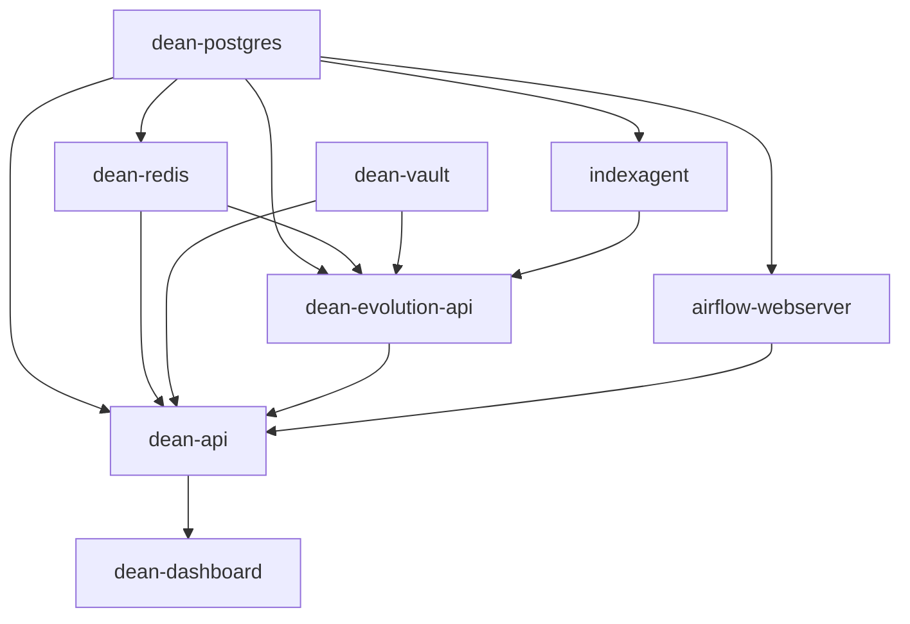

# DEAN System Integration with Infrastructure Orchestration

This document describes how the DEAN system integrates with the infrastructure orchestration layer and provides guidance for unified deployment.

## Architecture Overview

The infrastructure consists of two deployment models:

### 1. **Integrated Deployment** (Recommended)
Uses the `infra/` repository as the orchestration layer for all services including DEAN.

```
infra/
├── docker-compose.yml          # Main orchestration
├── docker-compose.dean.yml     # DEAN-specific services
└── docker-compose.dean.prod.yml # Production config
```

### 2. **Standalone DEAN Deployment**
Uses the `DEAN/` repository independently with its own infrastructure.

```
DEAN/
├── docker-compose.yml          # Development
└── docker-compose.prod.yml     # Production
```

## Service Architecture

### Integrated Services Map

| Service | Repository | Port | Container Name | Purpose |
|---------|-----------|------|----------------|---------|
| **PostgreSQL** | infra | 5432 | dean-postgres | Shared database for all services |
| **Redis (infra)** | infra | 6379 | redis | General caching |
| **Redis (DEAN)** | infra | 6380 | dean-redis | Agent registry |
| **Airflow** | airflow-hub | 8080 | airflow-webserver | Workflow orchestration |
| **IndexAgent** | IndexAgent | 8081 | indexagent | Code indexing |
| **DEAN Evolution API** | infra | 8090 | dean-evolution-api | Evolution engine |
| **DEAN API** | infra | 8091 | dean-api | Main DEAN API |
| **DEAN Dashboard** | infra | 8092 | dean-dashboard | Web interface |
| **Vault** | infra | 8200 | dean-vault | Secrets management |
| **Prometheus** | infra | 9090 | prometheus | Metrics |
| **Grafana** | infra | 3000 | grafana | Dashboards |

### Database Schema

The integrated deployment uses a single PostgreSQL instance with multiple databases:

```sql
-- Created by infra/scripts/create_databases.sql
CREATE DATABASE airflow;        -- Airflow metadata
CREATE DATABASE indexagent;     -- IndexAgent data
CREATE DATABASE market_analysis; -- Market analysis service
CREATE DATABASE agent_evolution; -- DEAN evolution data
CREATE DATABASE dean_production; -- DEAN core (if using standalone)
```

## Deployment Options

### Option 1: Fully Integrated Deployment (Recommended)

This approach uses the infra repository to orchestrate all services:

```bash
cd infra

# 1. Validate environment
./scripts/validate_deployment.ps1 -AutoFix

# 2. Configure environment
cp .env.example .env
# Edit .env with required values

# 3. Deploy all services
make up

# Or deploy DEAN specifically
docker compose -f docker-compose.dean.yml up -d
```

**Advantages:**
- Single point of orchestration
- Shared infrastructure (PostgreSQL, Redis, monitoring)
- Unified logging and monitoring
- Consistent networking
- Resource optimization

### Option 2: Hybrid Deployment

Run DEAN services through infra while maintaining DEAN's nginx/SSL:

```bash
# 1. Deploy infrastructure services
cd infra
docker compose up -d postgres redis vault prometheus grafana

# 2. Deploy DEAN with its own nginx
cd ../DEAN
./scripts/setup_environment.ps1 -Environment production
./deploy_windows.ps1
```

**Use when:**
- You need DEAN's specific nginx configuration
- SSL/TLS requirements differ from other services
- Gradual migration to integrated deployment

### Option 3: Standalone DEAN

Deploy DEAN completely independently:

```bash
cd DEAN
./scripts/setup_environment.ps1 -Environment production -GenerateSecrets
./scripts/validate_deployment.ps1 -AutoFix
./deploy_windows.ps1
```

**Use when:**
- Testing DEAN in isolation
- Different infrastructure requirements
- Separate production environments

## Configuration Management

### Environment Variables

The integrated deployment uses a hierarchy of environment files:

```
infra/.env                 # Infrastructure-wide settings
├── CLAUDE_API_KEY         # Shared across services
├── ANTHROPIC_API_KEY      # Shared across services
├── DOCKER_DEFAULT_PLATFORM # Platform settings
└── Service-specific vars

DEAN/.env                  # DEAN-specific settings (if standalone)
├── JWT_SECRET_KEY         # DEAN authentication
├── POSTGRES_*             # Database connection
└── REDIS_*                # Cache settings
```

### Secrets Management

Integrated deployment uses HashiCorp Vault:

```bash
# Store DEAN secrets in Vault
vault kv put secret/dean \
  jwt_secret_key="your-secret" \
  service_api_key="your-api-key"

# Access in DEAN services
VAULT_URL: http://dean-vault:8200
VAULT_TOKEN: ${VAULT_TOKEN}
```

## Migration Guide

### From Standalone DEAN to Integrated Deployment

1. **Backup existing data**:
   ```bash
   cd DEAN
   docker exec dean-postgres pg_dump -U dean_prod dean_production > dean_backup.sql
   ```

2. **Stop DEAN services**:
   ```bash
   docker compose down
   ```

3. **Prepare integrated environment**:
   ```bash
   cd ../infra
   cp ../DEAN/.env .env.dean
   # Merge required variables into infra/.env
   ```

4. **Import data**:
   ```bash
   docker compose up -d postgres
   docker exec -i dean-postgres psql -U dean_user -d dean_production < dean_backup.sql
   ```

5. **Start integrated services**:
   ```bash
   docker compose -f docker-compose.dean.yml up -d
   ```

## Conflict Resolution

### Port Conflicts

If both deployments are needed simultaneously:

1. **Modify DEAN standalone ports**:
   ```yaml
   # DEAN/docker-compose.override.yml
   services:
     dean-orchestrator:
       ports:
         - "8182:8082"  # Changed from 8082
     dean-nginx:
       ports:
         - "8080:80"    # Changed from 80
         - "8443:443"   # Changed from 443
   ```

2. **Use different database names**:
   ```env
   # DEAN/.env
   POSTGRES_DB=dean_standalone
   ```

### Service Name Conflicts

The integrated deployment uses prefixed names to avoid conflicts:
- `dean-postgres` vs standalone `postgres`
- `dean-redis` vs infra `redis`
- `dean-api` vs `dean-orchestrator`

## Monitoring and Observability

### Integrated Monitoring

The infra deployment provides unified monitoring:

```yaml
# Access monitoring dashboards
Prometheus: http://localhost:9090
Grafana: http://localhost:3000
  - DEAN Evolution Dashboard
  - Agent Performance Metrics
  - Economic Analysis
```

### Log Aggregation

```bash
# View all DEAN-related logs
docker compose logs -f dean-api dean-evolution-api agent-evolution

# Filter by service
docker compose logs --tail=100 dean-api | grep ERROR
```

## Troubleshooting

### Common Integration Issues

1. **Database Connection Failures**
   ```bash
   # Check database name consistency
   docker exec dean-postgres psql -U dean_user -l
   
   # Verify connection string
   docker exec dean-api env | grep DATABASE_URL
   ```

2. **Service Discovery Issues**
   ```bash
   # Verify network connectivity
   docker network ls
   docker network inspect infra_dean-network
   
   # Test service connectivity
   docker exec dean-api ping dean-postgres
   ```

3. **Volume Mount Issues**
   ```bash
   # Check volume mounts
   docker inspect dean-api | jq '.[0].Mounts'
   
   # Verify permissions
   docker exec dean-api ls -la /app/worktrees
   ```

### Health Checks

```bash
# Integrated health check
curl http://localhost:8091/health  # DEAN API
curl http://localhost:8090/health  # Evolution API
curl http://localhost:8081/health  # IndexAgent

# Comprehensive system check
./scripts/verify_infrastructure.sh
```

## Best Practices

1. **Use integrated deployment for production** - Better resource utilization and monitoring
2. **Maintain consistent naming** - Follow the service naming conventions
3. **Centralize configuration** - Use infra/.env for shared settings
4. **Monitor resource usage** - Set appropriate limits in docker-compose
5. **Regular backups** - Use infra backup scripts for all databases
6. **Security first** - Use Vault for sensitive data, not .env files

## Appendix: Service Dependencies



---

For additional support, see:
- [Infrastructure README](../README.md)
- [DEAN Deployment Guide](../../DEAN/docs/DEPLOYMENT_GUIDE.md)
- [Troubleshooting Guide](../../DEAN/docs/TROUBLESHOOTING.md)